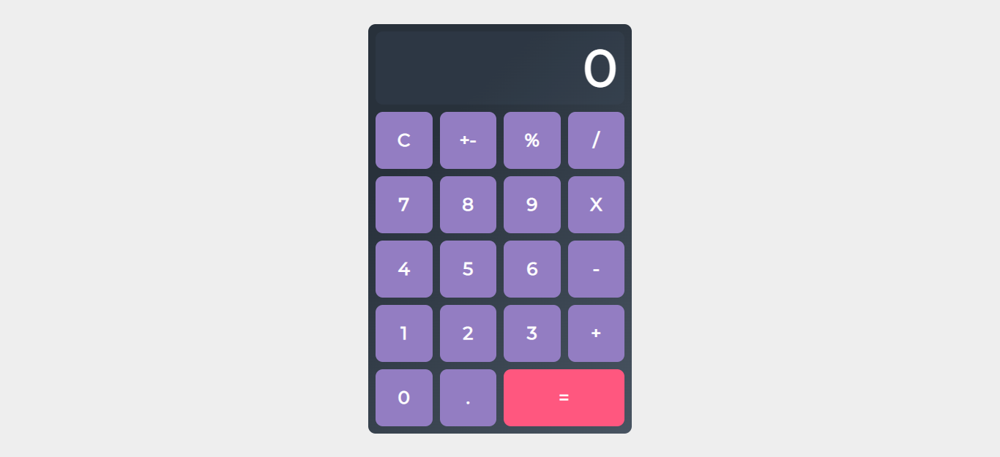

# Calculator

## Rules
1. Should be able to perform an operation on two numbers.
2. Basic error reporting.
3. Code is modular and bug-free.

## About the project

This calculator was created for a technical interview. To see it working live, [click here](https://calculator-coderbyte.netlify.app/).
